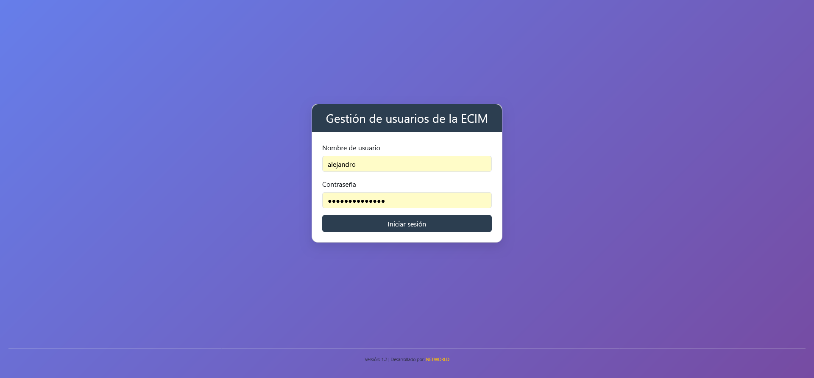
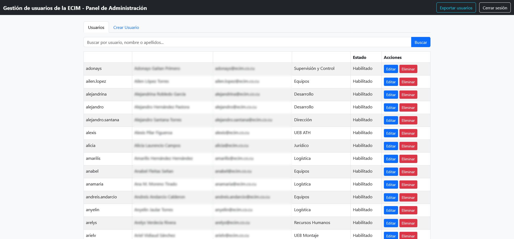
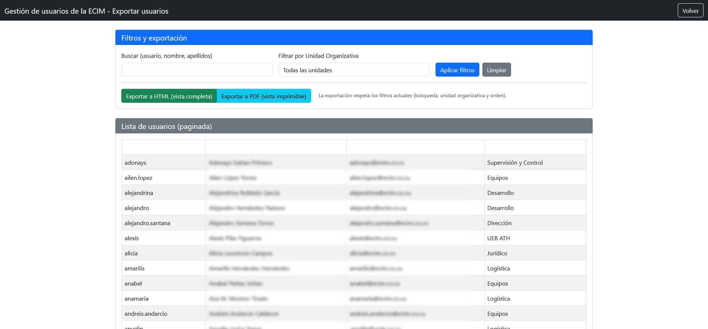

# SCUserManager - Gestión de usuarios Samba4 + Carbonio CE

Aplicación web para administrar usuarios en Active Directory (Samba4) y buzones de correo en Zextras Carbonio CE.

## ✨ Características

- Crear, editar, eliminar, bloquear/desbloquear usuarios
- Asignar a Unidades Organizativas y Grupos
- Creación automática de buzón en Carbonio CE
- Panel de autoservicio para cambio de contraseña
- Exportación a HTML/PDF con filtros
- Exclusión de usuarios no deseados
- Ordenamiento por columnas
- Paginación y búsqueda

## 📸 Capturas de pantalla

### Pantalla de inicio de sesión

### Lista de usuarios (panel de administración)

### Exportación de usuarios (lista a exportar)

## 🔧 Instalación

Ver [INSTALL.md](INSTALL.md)

## 📄 Licencia

Código abierto.

## 👨‍💻 Desarrollado por

**NETWORLD** – [https://networldcu.com](https://networldcu.com)
